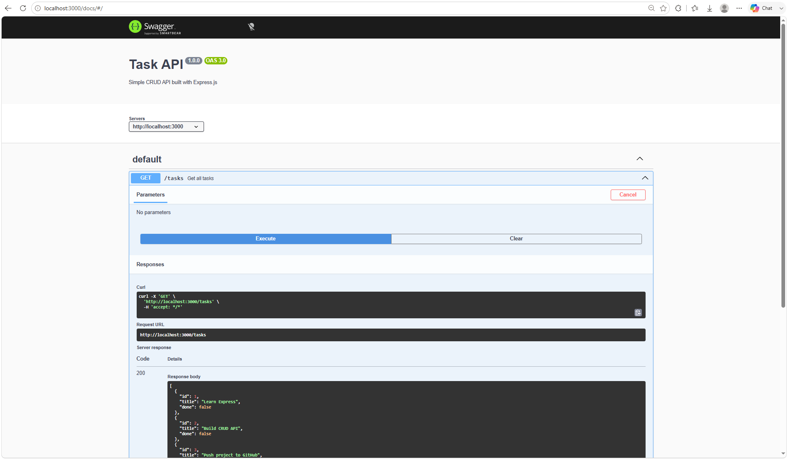
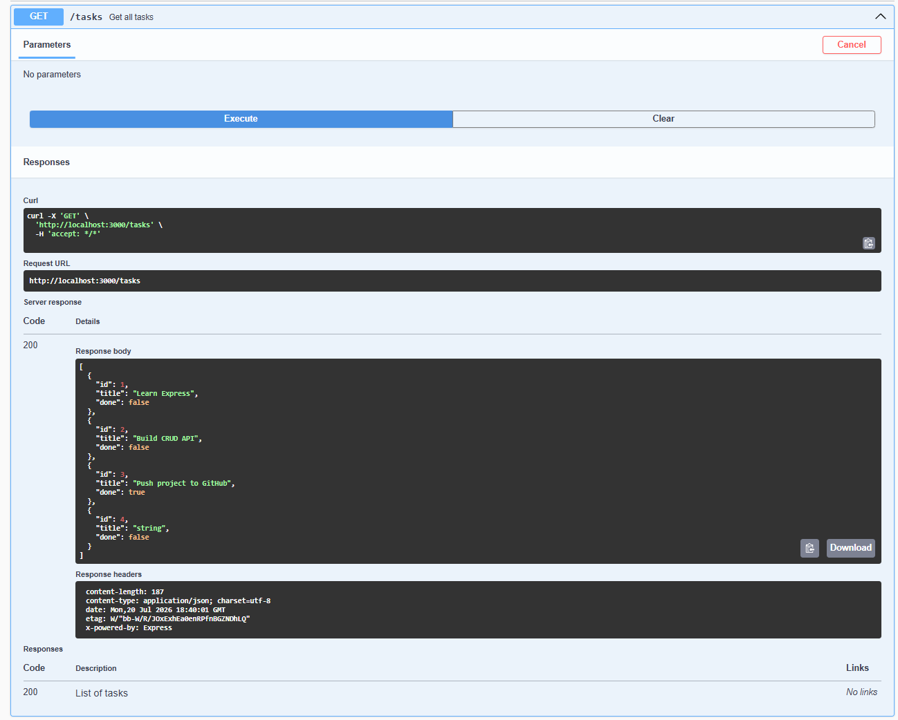
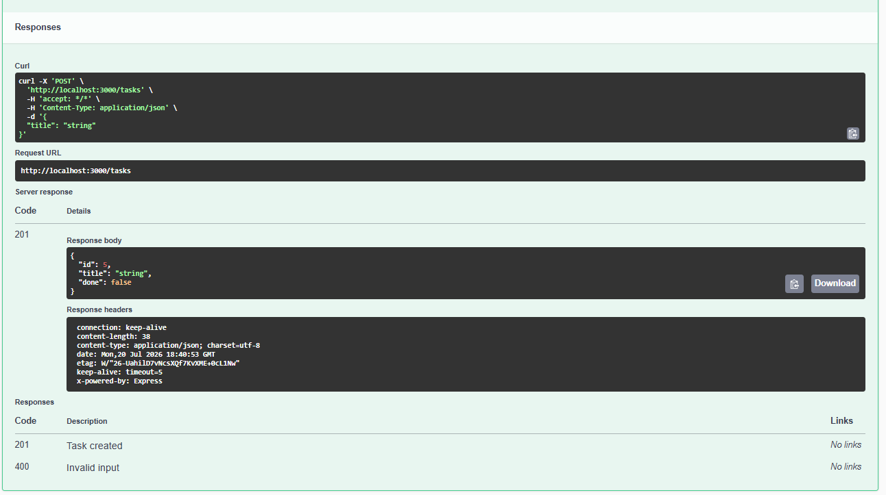
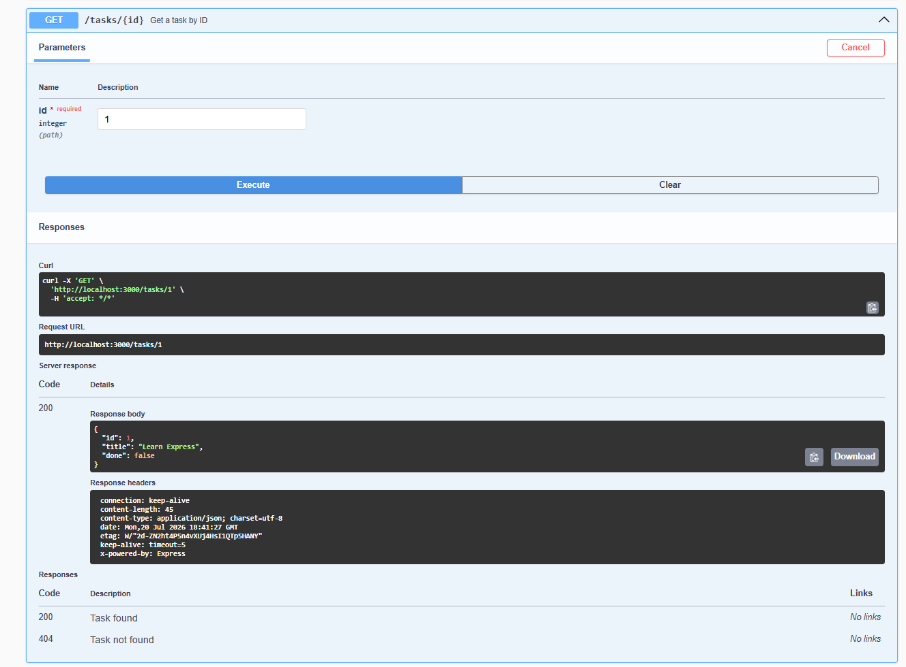
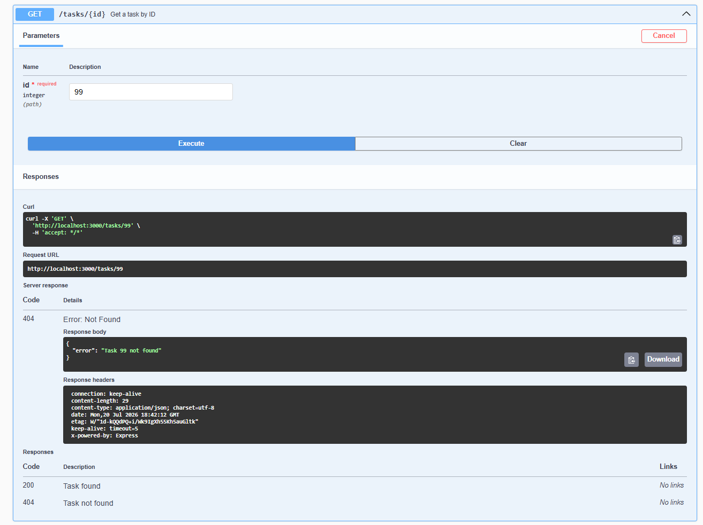
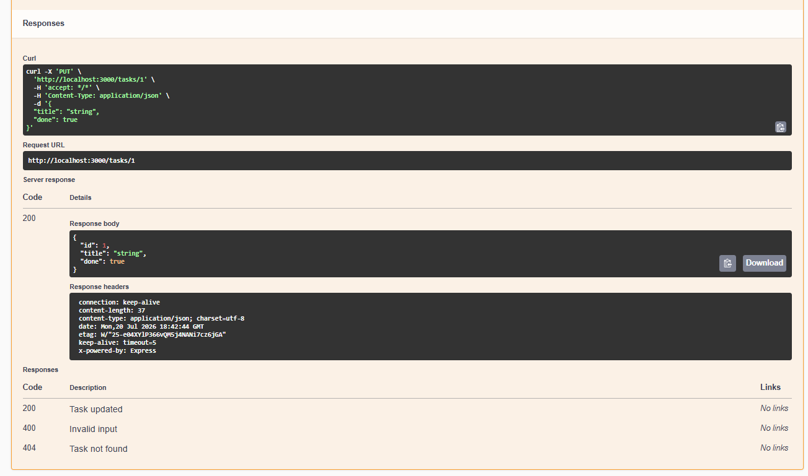
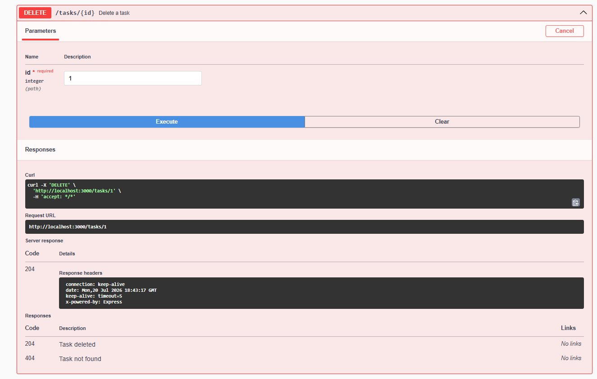
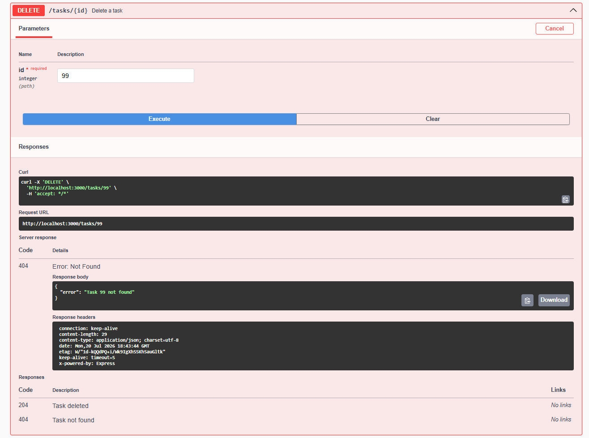
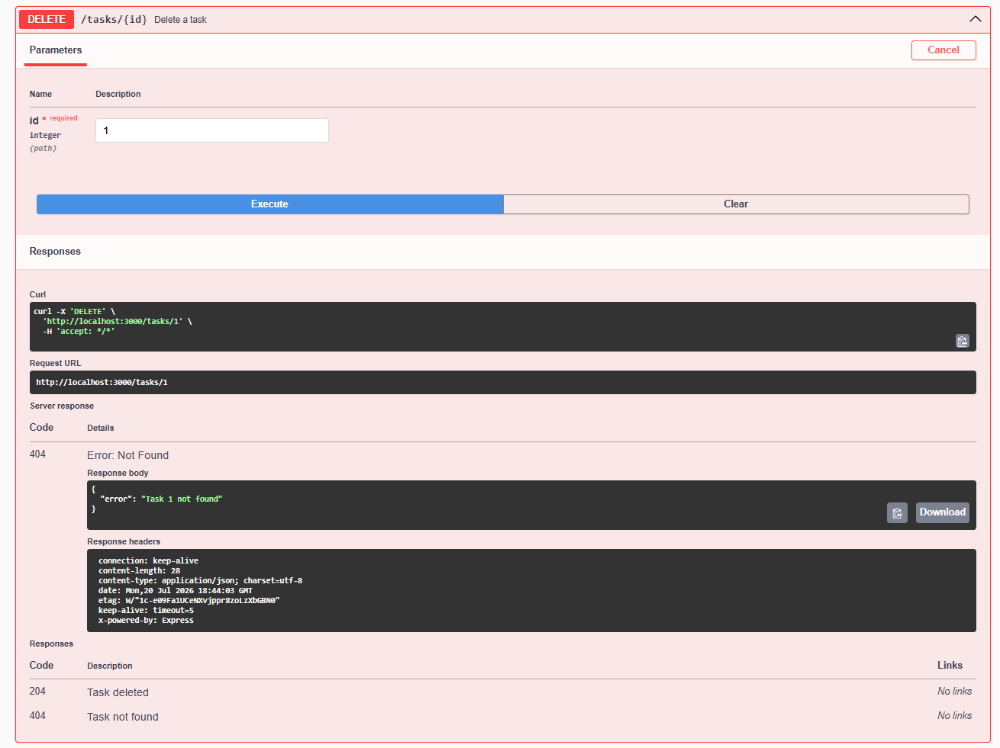

## Swagger UI Testing Results

The following screenshots demonstrate that the API was successfully tested through **Swagger UI** using the **Try it out** feature. Each CRUD operation was verified, including successful responses and error handling.

### 1. Swagger UI Overview

The interactive Swagger UI showing all available API endpoints.
 //SWAGGER UI

### 2. GET /tasks

Retrieves the complete list of tasks stored in the in-memory data structure.
 //GET

### 3. POST /tasks

Creates a new task successfully and returns **201 Created**.
 //POST

### 4. GET /tasks/{id} (Existing Task)

Retrieves an existing task by its ID and returns **200 OK**.
 //GET Task 1

### 5. GET /tasks/{id} (Non-Existing Task)

Attempts to retrieve a task that does not exist and correctly returns **404 Not Found**.
 //GET Task 99

### 6. PUT /tasks/{id}

Updates an existing task successfully and returns the updated resource.
 //PUT

### 7. DELETE /tasks/{id} (Existing Task)

Deletes an existing task successfully and returns **204 No Content**.
 //DELETE TASK 1

### 8. DELETE /tasks/{id} (Non-Existing Task)

Attempts to delete a task that does not exist and correctly returns **404 Not Found**.
 //DELETE TASK 99

### 9. Repeated DELETE Request

A repeated delete request confirms that the task has already been removed and the API consistently returns **404 Not Found**.
 //DELETE Task 99 Again